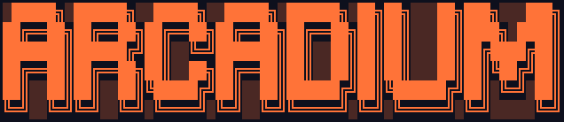
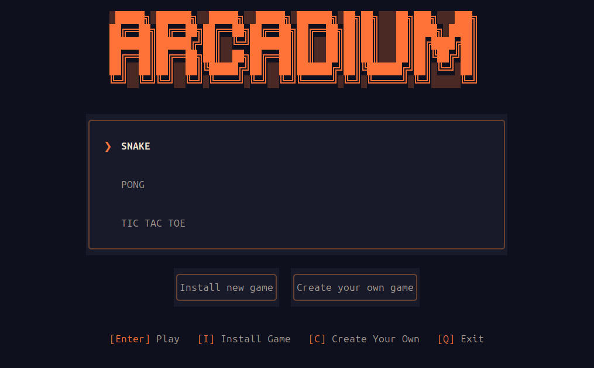
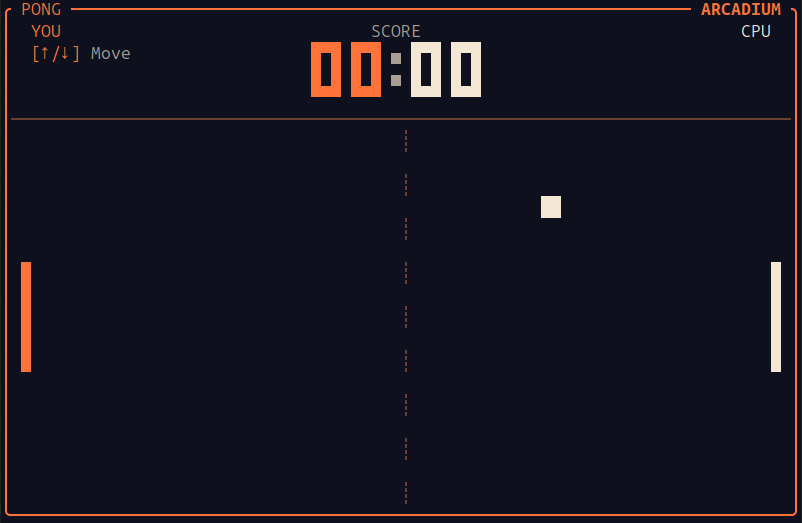
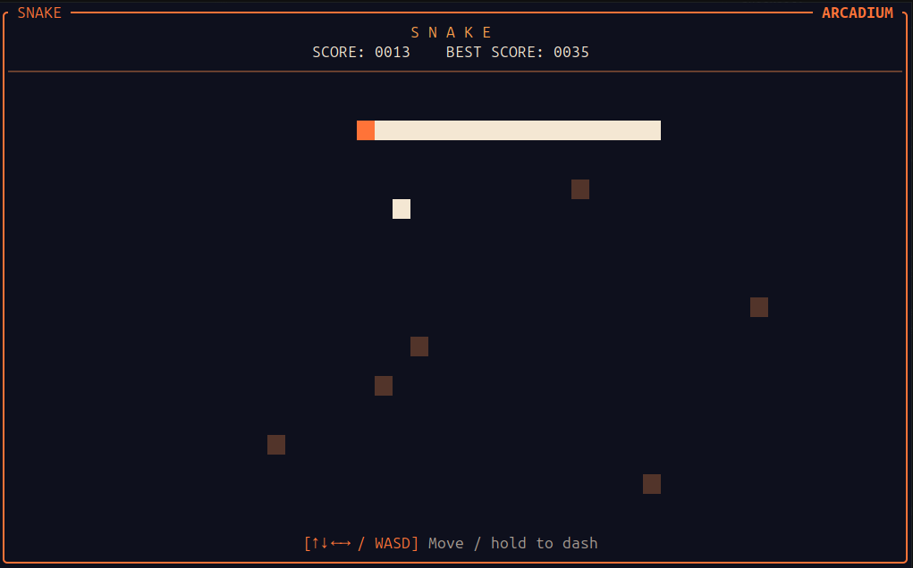
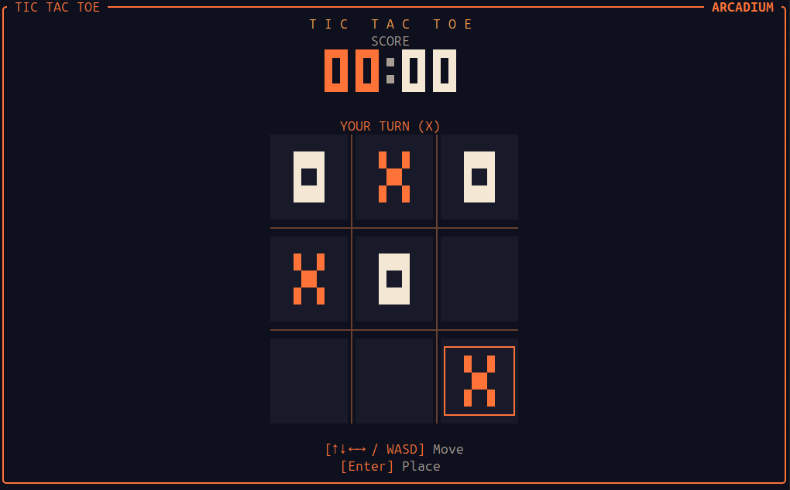

<p align="center">
    
</p>

[Installation guide](#installation)

## What is Arcadium?
It's an arcade cabinet that runs directly in your terminal. Written in [Rust](https://github.com/rust-lang/rust) + [Ratatui](https://github.com/ratatui/ratatui).

## What can you do in Arcadium?
- You can have fun playing the default games - Snake, Pong and Tic Tac Toe - already available!
- CREATE your own game (see [Creating Games for Arcadium guide](docs/creating-games.md)).
- Install external games created by other users (see [Installing Games for Arcadium guide](docs/installing-games.md)).

<p align="center">
    
</p>

<p align="center">



</p>

## Installation

Arcadium is available for Linux (x86-64) and macOS (Apple Silicon or Intel).

1. Download the archive for your system from the [latest release](https://github.com/LucaBTE/Arcadium/releases/latest) and extract it.
2. Open a terminal in the extracted folder and run:

   ```sh
   ./install.sh
   ```
   Note: you might need to first move into the 'arcadium-v0.1.0' folder first
   ```sh
   cd arcadium-v0.1.0
   ./install.sh
   ```


3. Start the app with:

   ```sh
   arcadium
   ```
   NOTE: You can run 'arcadium' command wherever you want! You don't have to go everytime inside the extracted folder.

If `arcadium` is not found, run `~/.local/bin/arcadium`. The installer also shows how to add that folder to your `PATH`.


## Contribution guide

Bug reports, ideas, and code contributions are welcome. Open an [issue](https://github.com/LucaBTE/Arcadium/issues) to report a problem or suggest a feature.

To contribute code, install Git and Rust, then:

1. [Fork the repository](https://github.com/LucaBTE/Arcadium/fork) and clone your fork. Replace `YOUR_USERNAME` with your GitHub username:

   ```sh
   git clone https://github.com/YOUR_USERNAME/Arcadium.git
   cd Arcadium
   git remote add upstream https://github.com/LucaBTE/Arcadium.git
   git fetch upstream
   git switch -c my-change upstream/dev
   ```

2. Make your changes. To run Arcadium locally:

   ```sh
   ARCADIUM_BUNDLED_GAMES_DIR="$PWD/bundled-games" cargo run -p arcadium-cli
   ```

3. Check your changes before submitting:

   ```sh
   cargo fmt --all -- --check
   cargo check --workspace
   cargo clippy --workspace --all-targets -- -D warnings
   cargo test --workspace
   ```

4. Push your branch with `git push -u origin my-change`, then open a pull request to `dev`. Briefly explain what you changed and how you tested it.

Want to create a game for Arcadium? Start with the [game creation guide](docs/creating-games.md).

## License

Arcadium is licensed under the [MIT License](LICENSE).
